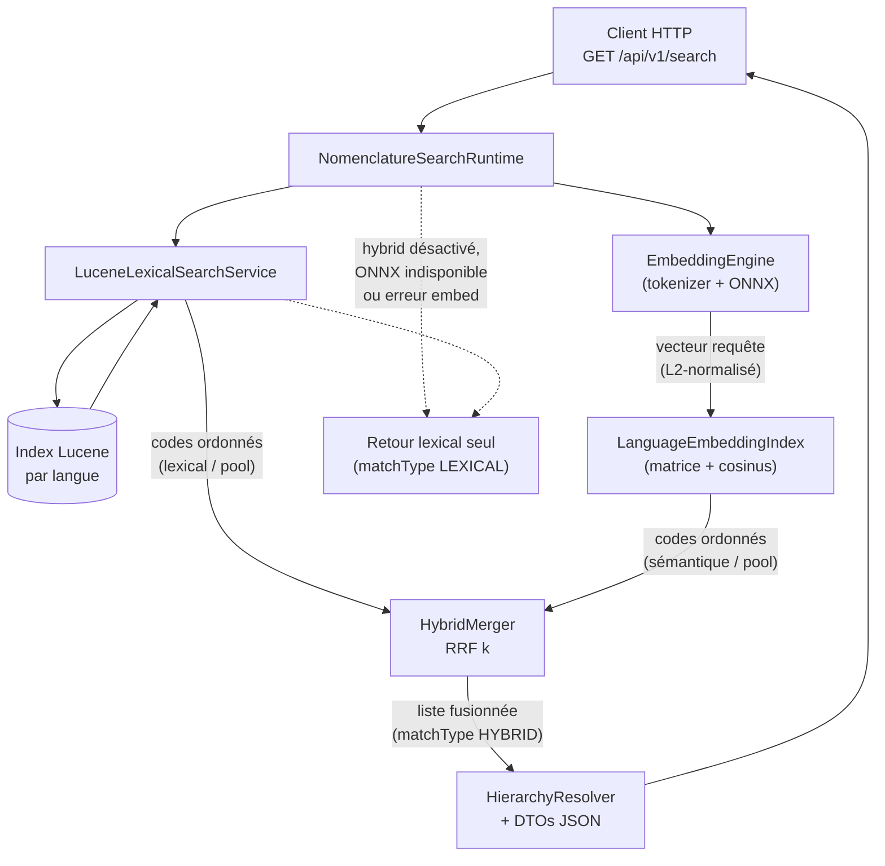
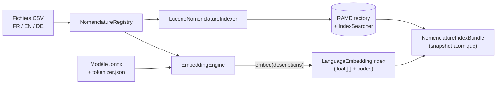

# Architecture Patterns: HS Code Hybrid Search API

**Domain:** Hybrid search (BM25 fuzzy + ONNX semantic embeddings) over hierarchical HS customs nomenclature
**Researched:** 2026-04-03
**Confidence:** HIGH for Lucene and Spring Boot patterns; HIGH for ONNX Java API; MEDIUM for hybrid scoring fusion

---

## Recommended Architecture

### System Overview

```
┌─────────────────────────────────────────────────────────────────────┐
│                        Spring Boot Application                       │
│                                                                      │
│  ┌────────────┐   ┌─────────────┐   ┌──────────────────────────┐   │
│  │  REST API  │──▶│  Search     │──▶│  Hybrid Score Merger     │   │
│  │  Layer     │   │  Orchestr.  │   │  (BM25 + Cosine → rank)  │   │
│  └────────────┘   └──────┬──────┘   └──────────────────────────┘   │
│                          │                    ▲          ▲          │
│                    ┌─────┴──────┐             │          │          │
│                    │            │             │          │          │
│              ┌─────▼────┐  ┌───▼──────┐      │          │          │
│              │  Lucene   │  │ Embedding│      │          │          │
│              │  Index    │  │  Engine  │──────┘          │          │
│              │  (BM25+   │  │  (ONNX)  │                 │          │
│              │  FuzzyQ)  │  └──────────┘                 │          │
│              └─────┬─────┘                               │          │
│                    │                                      │          │
│              ┌─────▼──────────────────────────┐          │          │
│              │  HS Nomenclature Registry       │──────────┘          │
│              │  (in-memory, per-language)      │                     │
│              └─────────────────────────────────┘                     │
│                    ▲                                                  │
│                    │                                                  │
│              ┌─────┴──────────────────────────┐                     │
│              │  Ingestion Pipeline             │                     │
│              │  (CSV → HsEntry → Index build)  │                     │
│              └─────────────────────────────────┘                     │
│                    ▲                                                  │
│                    │  /api/admin/reload                               │
│              ┌─────┴──────┐                                          │
│              │  Reload     │                                          │
│              │  Endpoint   │                                          │
│              └─────────────┘                                         │
└──────────────────────────────────────────────────────────────────────┘
```

---

## Schéma d’architecture : Lucene + ONNX (implémentation actuelle)

Le service combine une **recherche lexicale Apache Lucene** (BM25 via `SimpleQueryParser`, branche **fuzzy** optionnelle sur les tokens) et une **recherche sémantique** via le modèle **ONNX** multilingue (DJL tokenizers + ONNX Runtime). Les deux listes de codes candidats (même *pool* plafonné, dérivé de `limit`) sont fusionnées par **RRF** (`HybridMerger.rrfMerge`), pas par une combinaison linéaire BM25/cosinus. Si `hybrid=false`, ONNX n’est pas invoqué pour la requête et seule la voie Lucene produit les résultats.

### Flux d’une requête de recherche (`GET /api/v1/search`)



### Démarrage et rechargement (`NomenclatureIndexBundle`)

Les CSV nomenclature alimentent à la fois le **registre** métier, l’**index Lucene** (analyseur par langue) et, si ONNX est activé, la **matrice d’embeddings** (une ligne par entrée indexable, fingerprint + cache disque optionnel).



### Tableau synthétique

| Couche | Technologie | Entrée requête | Sortie |
|--------|-------------|----------------|--------|
| **Lexical** | Lucene 9, analyzers FR/EN/DE, `BooleanQuery` BM25 ∪ fuzzy | Texte `q` | Hits ordonnés par score Lucene → codes HS |
| **Sémantique** | ONNX Runtime, mean pooling + L2 | Même texte `q` | Vecteur requête ; cosinus vs matrice précalculée → codes HS |
| **Fusion** | RRF sur les deux listes de codes (rang 1-based, paramètre `k`) | Deux listes de codes dans le pool | Ordre fusionné ; score API dérivé du RRF brut |

### Fichiers / classes repères (code)

- Lucene : `LuceneLexicalSearchService`, `LuceneNomenclatureIndexer`, `LuceneAnalyzers`
- ONNX : `EmbeddingEngine`, `LanguageEmbeddingIndex`, `NomenclatureEmbeddingText`
- Orchestration : `NomenclatureSearchRuntime`, `HybridMerger`
- Rechargement : `POST /api/v1/admin/reload` → nouveau bundle, ancien fermé

---

## Component Boundaries

| Component | Responsibility | Input | Output | Communicates With |
|-----------|---------------|-------|--------|-------------------|
| **REST API Layer** | HTTP contract, request validation, language detection | HTTP request | HTTP response with ranked results | SearchOrchestrator |
| **SearchOrchestrator** | Coordinates the two search paths, triggers merger | Query string + lang | Merged ranked list | LuceneSearcher, EmbeddingSearcher, HybridMerger |
| **LuceneSearcher** | BM25 + fuzzy text search against the Lucene index | Query string | List of (HsCode, BM25 score) | NomenclatureIndex |
| **NomenclatureIndex** | Holds per-language Lucene RAMDirectory + IndexSearcher | — | Lucene IndexReader/Searcher | LuceneSearcher, IndexBuilder |
| **EmbeddingEngine** | Runs ONNX tokenizer + model, produces float[] embeddings | Text string | float[384] vector | SearchOrchestrator, IndexBuilder |
| **EmbeddingSearcher** | Brute-force cosine similarity against stored embedding vectors | float[] query vector | List of (HsCode, cosine score) | EmbeddingStore |
| **EmbeddingStore** | In-memory array of (hsCode, float[]) pairs, per language | — | float[][] + String[] | EmbeddingSearcher, IndexBuilder |
| **HybridMerger** | Reciprocal Rank Fusion or linear score combination | BM25 results + cosine results | Unified ranked list | SearchOrchestrator |
| **HierarchyResolver** | Given a 6-digit code, resolves chapter (2-digit) + heading (4-digit) parents | HsCode string | HierarchyContext | REST Layer (enriches response) |
| **NomenclatureRegistry** | Central in-memory store of all HsEntry objects keyed by code | — | HsEntry lookup | All components needing label/description |
| **IngestionPipeline** | Reads CSV, parses HsEntry, dispatches to index builders | CSV file path | HsEntry stream | IndexBuilder, EmbeddingEngine, NomenclatureRegistry |
| **ReloadEndpoint** | Triggers full rebuild; swaps live index atomically | HTTP POST | 200 OK | IngestionPipeline |

---

## Core Domain Model

```java
// Single record from the nomenclature
record HsEntry(
    String code,          // "0101.21.00" or normalized "010121"
    int level,            // 2=chapter, 4=heading, 6=subheading
    String description,   // "Live horses, pure-bred breeding animals"
    Language language,    // FR, EN, DE
    String parentCode     // "0101" for "010121", null for chapters
) {}

enum Language { FR, EN, DE }

// Result returned to caller
record SearchResult(
    HsEntry entry,
    double hybridScore,
    double bm25Score,
    double cosineScore,
    HierarchyContext hierarchy   // chapter + heading context
) {}

record HierarchyContext(
    HsEntry chapter,    // 2-digit parent
    HsEntry heading,    // 4-digit parent
    List<HsEntry> siblings  // other 6-digit codes under same heading
) {}
```

---

## Data Flow

### Startup / Reload Flow

```
CSV files (FR/EN/DE)
        │
        ▼
IngestionPipeline.ingest(lang, csvPath)
        │
        ├─── parse rows ──▶ List<HsEntry>
        │
        ├─── NomenclatureRegistry.populate(entries)
        │       └─── Map<String, HsEntry> (code → entry)
        │
        ├─── IndexBuilder.buildLuceneIndex(entries)
        │       └─── RAMDirectory per language
        │               ├─── Field: "code" (stored, not analyzed)
        │               ├─── Field: "description" (TextField, analyzed, BM25)
        │               └─── Field: "level" (stored, IntPoint filter)
        │
        └─── IndexBuilder.buildEmbeddingStore(entries)
                └─── for each HsEntry:
                        EmbeddingEngine.embed(entry.description)
                        → float[384] stored in EmbeddingStore
                        → parallel array: hsCode[], float[][]
```

**Atomic swap on reload:** IndexBuilder builds into a staging object; ReloadEndpoint
calls `NomenclatureIndex.swap(staging)` which is a single volatile reference write — no
lock required for readers already mid-query.

### Query Flow

```
HTTP GET /api/search?q=cheval+de+course&lang=fr&limit=10
        │
        ▼
REST Layer
  ├─── validate q (non-empty, max length)
  ├─── resolve lang (param > Accept-Language header > default FR)
  └─── call SearchOrchestrator.search(q, lang, limit)
              │
              ├─── LuceneSearcher.search(q, lang, limit * 3)
              │       ├─── BooleanQuery:
              │       │     ├─── FuzzyQuery(description, q, edit=2)   [lexical typos]
              │       │     └─── MatchAllDocsQuery boosted by BM25     [ranking]
              │       └─── returns List<ScoredHit> (luceneScore)
              │
              ├─── EmbeddingEngine.embed(q)  → float[384]
              │
              ├─── EmbeddingSearcher.search(queryVec, lang, limit * 3)
              │       └─── brute-force dot product over EmbeddingStore
              │            (N=~5000 entries, ~1ms at this scale)
              │            → returns List<ScoredHit> (cosineScore)
              │
              └─── HybridMerger.merge(luceneHits, embeddingHits, limit)
                      ├─── normalize scores: BM25 to [0,1], cosine already [0,1]
                      ├─── linear blend: hybrid = α*bm25_norm + (1-α)*cosine
                      │    recommended α=0.5, tunable via config
                      └─── sort descending, take limit
                              │
                              ▼
                      HierarchyResolver.enrich(results)
                              └─── look up parent codes in NomenclatureRegistry
                                      │
                                      ▼
                              List<SearchResult> returned to REST Layer
```

---

## In-Memory Index Structure

### Lucene Index (per language)

```
RAMDirectory (held in NomenclatureIndex, volatile reference)
  └─── Indexed documents (~5,000 per language):
        ┌─────────────────────────────────────────────┐
        │ Field: "code"        StoredField (retrieval) │
        │ Field: "level"       IntPoint (filter 2/4/6) │
        │ Field: "description" TextField (BM25 scored) │
        │ Field: "parentCode"  StoredField             │
        └─────────────────────────────────────────────┘
  └─── Similarity: BM25Similarity (default, k1=1.2, b=0.75)
  └─── Analyzer: StandardAnalyzer with per-language stop words
         FR: FrenchAnalyzer (stemmer + stopwords)
         EN: EnglishAnalyzer
         DE: GermanAnalyzer
```

**Why StandardAnalyzer variants over WhitespaceAnalyzer:** Stemming helps "chevaux" match
"cheval". The Lucene language analyzers (FrenchAnalyzer etc.) are mature and handle this.

**FuzzyQuery parameters:**
- `maxEdits = 2` for queries > 5 chars; `maxEdits = 1` for 3-5 chars
- `prefixLength = 2` (don't fuzz the first 2 chars — prevents false positives)
- These are tunable constants, not hardcoded.

### Embedding Store (per language)

```java
// EmbeddingStore structure
class EmbeddingStore {
    private volatile String[] hsCodes;    // parallel array, index = docId
    private volatile float[][] vectors;   // [numDocs][384]
    private final Language language;

    // Atomic swap during reload
    synchronized void swap(String[] newCodes, float[][] newVectors) { ... }
}
```

**Cosine similarity at this scale:** ~5,000 entries × 384 floats = ~7.3 MB per language.
Three languages = ~22 MB total embedding storage. Brute-force scan of 5,000 dot products
takes < 2ms on modern JVM. No approximate nearest-neighbor index (HNSW etc.) is needed.

**Pre-normalization:** Normalize all stored vectors to unit length at index time. At query
time, dot product equals cosine similarity — avoids the division at every lookup.

---

## Multilingual Strategy: Separate Indexes per Language

**Recommendation: Separate index instances per language, unified NomenclatureRegistry.**

| Concern | Separate Indexes | Unified Index |
|---------|-----------------|---------------|
| Analyzer quality | Language-specific stemmer per index | Compromised — can't apply FR stemmer to EN text |
| Query routing | Simple: route by lang param | Complex: must filter by lang field every query |
| Embedding space | Same multilingual model — vectors are cross-lingual | Same multilingual model |
| Memory | 3× storage (~66 MB total Lucene + 22 MB embeddings) | Slightly less but negligible |
| Rebuild isolation | Rebuild one lang without touching others | Full rebuild always |
| Code complexity | `Map<Language, NomenclatureIndex>` lookup | Single index, lang filter on every query |

**Winner: Separate indexes per language.**

Rationale: The Lucene language analyzers are the core quality lever for lexical matching.
Mixing French, English, and German text in a single index forces a compromise (e.g.,
StandardAnalyzer) that degrades recall for all three. The overhead is trivial at this scale.

The ONNX embedding model (`paraphrase-multilingual-MiniLM-L12-v2`) is cross-lingual by
design — the same model handles all three languages, so the EmbeddingEngine is a singleton.
Only the EmbeddingStore (which stores which codes map to which vectors) is per-language.

---

## Hybrid Scoring: Score Normalization and Fusion

### Problem

BM25 scores are unbounded positive floats (typically 0–20 for short text fields). Cosine
similarity is in [−1, 1] (practically [0, 1] for non-negative embedding models). Direct
linear combination without normalization gives BM25 scores disproportionate weight.

### Recommended Approach: Min-Max Normalization + Linear Blend

```java
// Within a single result set (not global normalization):
double bm25Norm  = (bm25 - bm25Min)  / (bm25Max  - bm25Min  + 1e-9);
double cosineNorm = cosine;  // already [0,1] after unit-vector pre-normalization

double hybrid = alpha * bm25Norm + (1 - alpha) * cosineNorm;
// alpha = 0.5 as default, configurable in application.properties
```

**Alternative: Reciprocal Rank Fusion (RRF)**

```java
// RRF: robust to score scale, no normalization needed
double rrf = 1.0 / (k + rankBM25) + 1.0 / (k + rankCosine);
// k = 60 (standard default, smooths rank differences)
```

RRF is simpler (no score normalization) and empirically strong. Recommended for the first
working version. Switch to linear blend only if RRF under-weights exact fuzzy matches (a
likely edge case for typos that score high on BM25 but low on cosine).

**Config flag:** `search.fusion.strategy=rrf|linear` with `search.fusion.alpha=0.5`

---

## Suggested Build Order

Dependencies flow strictly downward. Each layer can be built and tested in isolation before
the next layer depends on it.

```
Phase 1 ── Domain Model
           HsEntry, Language, SearchResult, HierarchyContext (records/enums)
           No dependencies — pure data. Testable immediately.
                │
                ▼
Phase 2 ── Ingestion Pipeline
           CSV → HsEntry stream → NomenclatureRegistry
           Depends on: Domain Model
           Test: load XLSX-converted CSV, assert entry count and hierarchy links
                │
                ▼
Phase 3a ── Lucene Index               Phase 3b ── Embedding Engine (parallel)
            IndexBuilder (Lucene)                  EmbeddingEngine (ONNX)
            NomenclatureIndex                      EmbeddingStore
            LuceneSearcher                         EmbeddingSearcher
            Depends on: Phase 2                    Depends on: Phase 2
            Test: fuzzy search returns             Test: embed("horse"), cosine
            expected codes                         against "cheval" cross-lang
                │                                          │
                └──────────────┬───────────────────────────┘
                               ▼
Phase 4 ── Hybrid Merger + HierarchyResolver
           HybridMerger (RRF or linear blend)
           HierarchyResolver (code → parent lookup in Registry)
           Depends on: Phase 3a + 3b
           Test: hybrid results rank "cheval de course" → equestrian codes
                │
                ▼
Phase 5 ── REST API Layer + Reload Endpoint
           SearchController, ReloadController
           LanguageDetector (Accept-Language parsing)
           Atomic index swap on reload
           Depends on: Phase 4
           Test: end-to-end HTTP tests, reload does not break in-flight queries
                │
                ▼
Phase 6 ── Score Tuning + Observability
           Tune alpha / RRF k, per-language analyzer config
           Structured logging of score components per result
           Actuator health/metrics endpoints
```

**Critical ordering rationale:**

- The Domain Model (HsEntry etc.) is the shared language of all components. It must be
  frozen before any component that produces or consumes it.
- IngestionPipeline must precede all index builders because they consume its output.
- Lucene (3a) and Embedding (3b) can be built in parallel — they share no runtime state.
- HybridMerger requires both search paths to produce results for integration testing.
- The REST layer should be the last stable component. Building it too early creates
  pressure to stabilize interfaces before the core is understood.

---

## Anti-Patterns to Avoid

### Anti-Pattern 1: Single Shared Lucene Analyzer for All Languages
**What:** Using `StandardAnalyzer` globally to keep the code simple.
**Why bad:** French stemming drops "chevaux" → "cheval"; German needs compound word
splitting ("Kraftfahrzeug" → "Kraft" + "fahrzeug"). Standard analyzer misses both.
**Instead:** Instantiate `FrenchAnalyzer`, `EnglishAnalyzer`, `GermanAnalyzer` per
language index. Wire them via `Map<Language, Analyzer>` in a `@Configuration` class.

### Anti-Pattern 2: Rebuilding Index Under a Lock (Blocking Queries)
**What:** Using `synchronized` around the index swap, so in-flight searches block during
the ~5s rebuild.
**Why bad:** Reload becomes a latency spike visible to users.
**Instead:** Build the new index into a staging `RAMDirectory`; swap the volatile
reference atomically; in-flight queries complete against the old reference (Java memory
model guarantees safe publication via `volatile`).

### Anti-Pattern 3: Embedding Every Query Twice (Language Detection + Search)
**What:** Running the ONNX model twice — once for language detection, once for embedding.
**Why bad:** ONNX inference is ~20ms per call; doing it twice doubles query latency.
**Instead:** Language is declared by the caller (or trivially detected from the Accept-
Language header). No need to infer it from the query embedding.

### Anti-Pattern 4: Storing Raw (Unnormalized) Embedding Vectors
**What:** Storing embeddings as-is and computing full cosine (dot / |a||b|) at query time.
**Why bad:** Division at every similarity computation, 5,000 times per query.
**Instead:** Normalize to unit length at index-build time. Query time becomes pure dot
product (single multiply-add per dimension per document).

### Anti-Pattern 5: Separate ONNX Model Instance per Request Thread
**What:** Creating a new `OrtSession` for each request.
**Why bad:** `OrtSession` construction is expensive (~200ms); creates memory pressure.
**Instead:** `OrtEnvironment` and `OrtSession` are thread-safe for inference. Instantiate
once as Spring `@Bean` (singleton scope), share across all request threads.

### Anti-Pattern 6: Embedding the HS Descriptions as a Single Flat String
**What:** `embed(code + " " + description)` mixes structural and semantic content.
**Why bad:** The code itself carries no semantic meaning for the embedding model; the
chapter/heading hierarchy adds signal only as additional descriptive text.
**Instead:** Embed `entry.description` only. For subheadings, optionally concatenate
the parent heading description: `heading.description + ". " + entry.description`.
This propagates taxonomic context into the embedding and improves type/subtype matching.

---

## Scalability Considerations

| Concern | Current Scale (~5K entries/lang) | If 50K entries | If 500K entries |
|---------|----------------------------------|----------------|-----------------|
| Lucene index size | ~5 MB RAM/lang | ~50 MB | ~500 MB → use FSDirectory |
| Embedding store | ~7 MB RAM/lang | ~70 MB | Switch to HNSW (e.g. HNSWLIB-Java) |
| Brute-force cosine | < 2ms | < 20ms | Too slow → approximate NN needed |
| Rebuild time | < 5s | ~30s | On-disk incremental index |
| Query latency | < 50ms total | ~100ms | Lucene query cache needed |

At 6-digit HS 2022 scope, there are ~5,600 subheadings + ~1,200 headings + ~97 chapters.
Total corpus per language: ~7,000 entries. Brute-force is entirely appropriate here and
no approximate nearest-neighbor infrastructure is required.

---

## Key Technology Choices

| Component | Technology | Confidence | Notes |
|-----------|------------|------------|-------|
| Text index | Apache Lucene 9.x (embedded) | HIGH | De-facto standard for embedded Java search |
| Language analyzers | Lucene `FrenchAnalyzer`, `EnglishAnalyzer`, `GermanAnalyzer` | HIGH | Ships with `lucene-analyzers-common` |
| Embedding runtime | ONNX Runtime Java (`com.microsoft.onnxruntime:onnxruntime`) | HIGH | Official Java binding, production-stable |
| Embedding model | `paraphrase-multilingual-MiniLM-L12-v2` (ONNX export) | MEDIUM | Known to work cross-lingual FR/EN/DE; verify ONNX export format |
| Score fusion | Reciprocal Rank Fusion (RRF, k=60) as default | MEDIUM | Empirically strong, no tuning needed initially |
| CSV parsing | OpenCSV or Apache Commons CSV | HIGH | Standard Java CSV; both work; Apache Commons has no transitive deps |
| XLSX → CSV conversion | Apache POI (build-time, not runtime) | HIGH | Already needed to read the XLSX source files |
| Dependency injection | Spring Boot 3.x `@Bean`/`@Service` | HIGH | Project constraint |

---

## Sources

- Lucene architecture: training data (Lucene 9.x, HIGH confidence — stable API)
- ONNX Runtime Java API: training data (ORT 1.16+, HIGH confidence)
- `paraphrase-multilingual-MiniLM-L12-v2` multilingual coverage: training data (MEDIUM — verify model card for FR/EN/DE quality)
- RRF scoring formula: Cormack, Clarke, Buettcher (2009), widely implemented — HIGH confidence
- In-memory index size estimates: derived from known Lucene storage constants — MEDIUM confidence
- Build order: derived from component dependency analysis — HIGH confidence (no external source needed)
